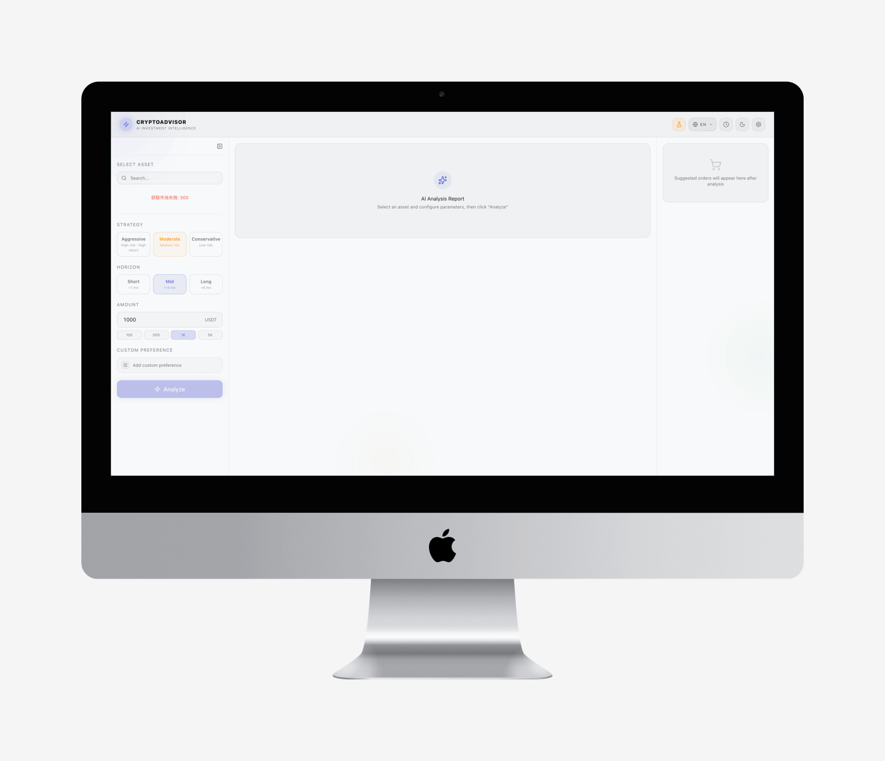

<div align="center">
  <h1>CryptoAdvisor AI</h1>

  <p><strong>AI 驱动的加密货币投资顾问 — 行情数据、分析报告、一键下单。</strong></p>

  <p>
    <a href="https://github.com/ruoduan-hub/cryptoadvisor-ai/releases"></a>
    <a href="https://github.com/ruoduan-hub/cryptoadvisor-ai/releases"></a>
    
    
    
    <a href="./LICENSE"></a>
  </p>

  <p>
    <a href="./README.md">English</a> · 简体中文
  </p>
</div>

CryptoAdvisor AI 是一个**纯前端**加密货币投资工具。选择币种、设定风险偏好，系统自动聚合 8 个公开 API 的实时行情数据，结合 AI 生成流式分析报告，包含入场价位、止损、止盈建议。确认后一键通过 CCXT 下单。

<p align="center">
  
</p>

<p align="center">
  
</p>

## 功能

- **多源行情聚合** — 实时价格、资金费率、未平仓合约、恐惧贪婪指数、链上数据、市场新闻，来自 8 个公开 API。
- **AI 流式分析** — SSE 实时推送分析报告，涵盖技术面、基本面、情绪面、风险提示。可配置投资风格和周期。
- **一键下单** — AI 生成带止损止盈的 CCXT 标准订单 JSON，审查确认后执行。
- **历史回放** — 每次分析自动保存至 IndexedDB，支持回看完整报告、再次使用、重新下单。
- **桌面应用** — 基于 Electron 打包，支持 macOS（universal）和 Windows（x64）。
- **双语界面** — 中英文无缝切换，零 hydration 闪烁。
- **无后端、无数据库** — 所有数据存储在浏览器本地，交易凭证绝不离开你的设备。

## 快速开始

### 环境要求

- Node.js 18+
- Anthropic API Key（或兼容端点）

### 安装

```bash
git clone https://github.com/ruoduan-hub/cryptoadvisor-ai.git
cd cryptoadvisor-ai

npm install
cp .env.example .env.local
# 可选，CACHE_TIME 默认 15（分钟）
```

### 开发

```bash
npm run dev          # 启动开发服务器
npm run build        # 生产构建
npm run type-check   # TypeScript 类型检查
```

### 桌面应用

```bash
npm run electron:dev          # 开发模式（热更新）
npm run electron:build:mac    # 构建 macOS .dmg（universal）
npm run electron:build:win    # 构建 Windows 安装包
```

## AI 密钥

AI 密钥**不**通过环境变量配置。用户在设置面板（Header 齿轮图标）中输入，仅保存在 `sessionStorage` 中，关闭标签页即清除，绝不持久化到磁盘或 localStorage。

## 架构

```
Browser / Electron
    │
    ├─ React 19 (App Router)
    │   ├─ CryptoSelector      — 币种搜索与选择
    │   ├─ InvestmentConfig     — 风险偏好 / 周期 / 金额
    │   ├─ MarketDataPanel      — 实时行情面板
    │   ├─ AnalysisReport       — 流式 AI 分析报告（Markdown）
    │   ├─ OrderPreview         — CCXT JSON 预览 + 下单执行
    │   └─ HistoryPanel         — IndexedDB 历史记录
    │
    ├─ Next.js API Routes
    │   ├─ /api/analyze         — AI 流式分析（SSE）
    │   ├─ /api/market          — CCXT 行情代理
    │   ├─ /api/markets         — 可用交易对
    │   └─ /api/order           — 下单执行
    │
    ├─ 外部数据（通过 rewrites 代理）
    │   ├─ /proxy/coinpaprika   — 市值与补充价格
    │   ├─ /proxy/alternative   — 恐惧贪婪指数
    │   ├─ /proxy/llama         — DeFi TVL
    │   ├─ /proxy/coindesk      — 市场新闻
    │   ├─ /proxy/coingecko     — 全球市场概览
    │   ├─ /proxy/binfutures    — 资金费率与未平仓合约
    │   └─ /proxy/mempool       — BTC 链上 mempool
    │
    └─ 存储
        ├─ IndexedDB            — 分析历史、交易对缓存
        ├─ sessionStorage       — 交易所凭证（临时）
        └─ localStorage         — 主题、语言偏好
```

## 数据源

所有外部 API 均为**公开接口**，无需 API Key。通过 Next.js `rewrites` 代理解决 CORS。

| 数据源 | 数据 | 代理前缀 | 缓存 |
| --- | --- | --- | --- |
| **CCXT（交易所）** | 实时 ticker、24h OHLC、成交量 | `/api/market` | 1 min |
| **CoinPaprika** | 币种市值、补充价格 | `/proxy/coinpaprika` | 5 min |
| **Alternative.me** | 恐惧贪婪指数（0–100） | `/proxy/alternative` | 15 min |
| **DeFiLlama** | 以太坊 DeFi TVL | `/proxy/llama` | 15 min |
| **CoinDesk** | 加密市场新闻 | `/proxy/coindesk` | 10 min |
| **CoinGecko** | 全球总市值、BTC/ETH 主导率 | `/proxy/coingecko` | 5 min |
| **Binance Futures** | 资金费率（8h）、未平仓合约 | `/proxy/binfutures` | 1 min |
| **mempool.space** | BTC mempool、推荐费率 | `/proxy/mempool` | 2 min |

<details>
<summary>各端点详情</summary>

#### CCXT（通过 `/api/market`）
```
POST /api/market
Body: { symbols: string[] }
→ Ticker: price, change24h, volume24h, high24h, low24h
```

#### CoinPaprika
```
GET /proxy/coinpaprika/v1/tickers/{coin-id}
→ quotes.USD: price, volume_24h, market_cap, percent_change_24h
```

#### Alternative.me
```
GET /proxy/alternative/fng?limit=1
→ data[0]: value, value_classification, timestamp
```

#### DeFiLlama
```
GET /proxy/llama/v2/historicalChainTvl/ethereum
→ 最后一条: { tvl, date }
```

#### CoinDesk
```
GET /proxy/coindesk/news/v1/article/list?lang=EN&limit=6
→ Data.Entries[]: TITLE, URL, PUBLISHED_ON, SOURCE_INFO.NAME
```

#### CoinGecko
```
GET /proxy/coingecko/api/v3/global
→ data: total_market_cap.usd, market_cap_percentage.{btc,eth},
        market_cap_change_percentage_24h_usd, active_cryptocurrencies
```

#### Binance Futures
```
GET /proxy/binfutures/fapi/v1/premiumIndex?symbol={symbol}
→ lastFundingRate

GET /proxy/binfutures/fapi/v1/openInterest?symbol={symbol}
→ openInterest
```

#### mempool.space
```
GET /proxy/mempool/api/v1/fees/recommended
→ fastestFee, halfHourFee, hourFee (sat/vB)

GET /proxy/mempool/api/mempool
→ count, vsize, total_fee
```

</details>

## 项目结构

```
src/
├── app/
│   ├── api/
│   │   ├── analyze/route.ts    # AI 分析（SSE 流式）
│   │   ├── market/route.ts     # CCXT 行情代理
│   │   ├── markets/route.ts    # 可用交易对
│   │   └── order/route.ts      # 下单执行
│   ├── layout.tsx              # 根布局、字体、主题
│   ├── page.tsx                # 主页面（SPA）
│   └── globals.css             # 设计 Token + 全局样式
├── components/
│   ├── CryptoSelector/         # 币种搜索与选择
│   ├── InvestmentConfig/       # 投资参数配置
│   ├── MarketDataPanel/        # 实时行情面板
│   ├── AnalysisReport/         # 流式报告渲染
│   ├── OrderPreview/           # CCXT JSON 预览与执行
│   ├── HistoryPanel/           # IndexedDB 历史记录
│   └── ui/                     # 基础组件（Button, Card, Badge）
├── lib/
│   ├── apiCache.ts             # TTL 缓存（module-level Map）
│   ├── marketApi.ts            # 公共 API 封装（含缓存）
│   ├── indexdb.ts              # IndexedDB 读写（via idb）
│   ├── ccxt.ts                 # CCXT 客户端
│   ├── i18n.ts                 # 中英文翻译字典
│   └── envConfig.ts            # 环境配置
├── contexts/
│   └── LocaleContext.tsx       # 语言 Context 与 Cookie 同步
├── hooks/
│   ├── useMarketData.ts
│   ├── useAnalysis.ts
│   └── useHistory.ts
└── types/
    └── index.ts                # 全局 TypeScript 类型定义
```

## 技术栈

| 层级 | 技术 |
| --- | --- |
| 框架 | Next.js 16 (App Router) |
| 语言 | TypeScript（严格模式） |
| 样式 | Tailwind CSS 4 |
| AI | Anthropic SDK (Claude) |
| 交易所 | CCXT |
| 本地存储 | IndexedDB（via `idb`） |
| 桌面端 | Electron + electron-builder |
| 图标 | Lucide React |
| 字体 | Orbitron / JetBrains Mono |

## 安全

- **交易所 API Key** 仅存储在 `sessionStorage` 中，关闭标签页即清除。绝不写入 localStorage、IndexedDB 或任何持久存储。
- **AI 密钥** 同样仅存储于 `sessionStorage`。
- **所有外部 API 调用** 通过 Next.js `rewrites` 代理，避免暴露客户端 IP。
- **AI 报告渲染** 使用 `react-markdown`，禁止 `dangerouslySetInnerHTML`。
- **无服务端数据库** — 所有用户数据仅存在于浏览器端。

## 缓存策略

缓存实现在 `src/lib/apiCache.ts`，基于 module-level `Map<string, { data, expiresAt }>`：

- **浏览器端**：缓存在当前 Tab 生命周期内有效。
- **服务端**：缓存在 Node.js 进程生命周期内跨请求复用。
- **默认 TTL**：通过 `CACHE_TIME` 环境变量配置（分钟），缺省 15 分钟。

| 级别 | TTL | 数据类型 |
| --- | --- | --- |
| 高频 | 1 min | 实时价格、资金费率、未平仓合约 |
| 中频 | 2–5 min | BTC 链上数据、全球市场概览 |
| 低频 | 10–15 min | 新闻、恐惧贪婪指数、DeFi TVL |

## 国际化

完整支持英文和简体中文，切换按钮位于 Header 右侧。

- **翻译字典**：`src/lib/i18n.ts` — 所有文案集中管理。
- **服务端检测**：语言偏好通过 Cookie + `layout.tsx` 服务端读取，SSR 直接输出正确语言，**零 hydration 闪烁**。
- **新增文案**：在 `i18n.ts` 的 `zh` 和 `en` 对象中同时添加 — TypeScript 会强制保持结构一致。

## 开源协议

MIT。详见 [`LICENSE`](./LICENSE)。
